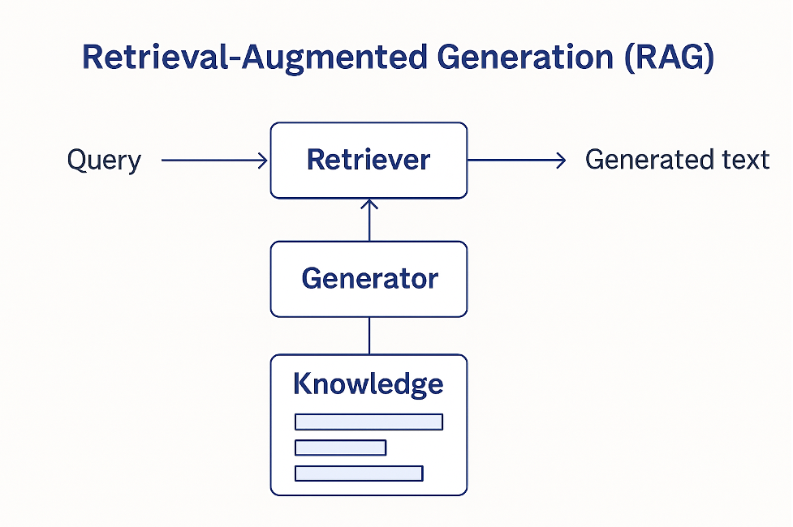
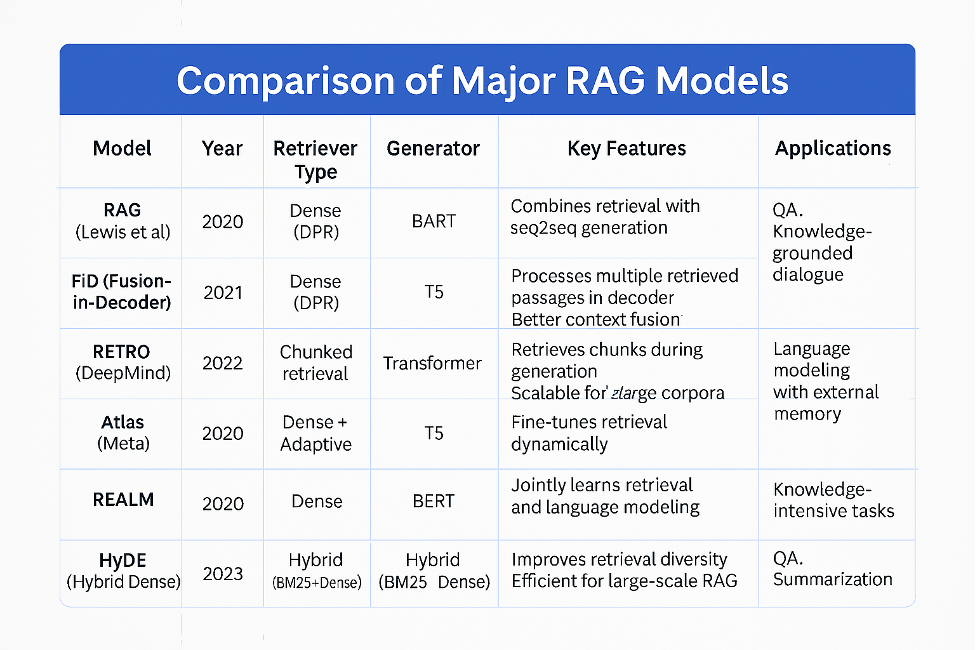

# NLP Assignment 1 - PS 10: Part B Literature Survey: Advancements in Retrieval-Augmented Generation for Knowledge-Enhanced Language Models

### Group ID: 61

### Group Members Name with Student ID:

1. Arpita Singh (2024AA05027) Contribution 100%
2. Rahul Sharma (2024AA05893) Contribution 100%
3. Sachit Pandey (2024AA05023) Contribution 100%
4. Avishek Ghatak (2024AA05895) Contribution 100%
5. Anoushka Guleria (2023AA05527) Contribution 100%

## 1. Introduction and Context

When we think about how modern AI assistants work, they seem incredibly capable - until you ask them something about last week's news, or a specific detail from a niche field. The problem is straightforward: these large language models are trained on data up to a certain point in time, and while they're good at synthesizing what they've learned, they can't really access new information or specialized knowledge on demand.

From reviewing several papers and research over the past few years, We noticed that researchers started questioning the conventional wisdom around 2019-2020. Instead of just throwing bigger and bigger models at problems, they wondered: what if we gave these systems the ability to look things up? What if they could retrieve relevant information from a knowledge base and then use that information to generate better answers? This idea led to Retrieval-Augmented Generation (RAG).

Think of it like the difference between asking someone who's read every book in the world (but whose training ended in 2020) versus giving someone access to a library and some research skills. The second person will probably give you better answers, especially for specialized topics or recent events.

The core idea behind RAG is simple but powerful: combine information retrieval with text generation. When someone asks a question, the system first searches through available documents to find relevant information, then uses that information as context when generating an answer. This approach has been gaining significant traction recently because it addresses several problems that plague traditional language models.

## 2. How RAG Actually Works: The Two-Stage Process

RAG systems typically operate in two distinct phases. First comes retrieval. When you pose a question or query, the system searches through a collection of documents - could be Wikipedia, academic papers, company documents, whatever - to find passages that might be relevant. This is where the "retrieval" part comes in.

The second phase is generation. Once relevant documents are found, they're fed into a language model along with your original question. The language model then generates an answer, ideally grounded in the retrieved information. This is the "augmented generation" part.

What's clever about this approach is that it lets the retrieval system and the generation system work together. You're not trying to cram everything into a single massive model. Instead, you have specialized components doing what they do best.

### Early Development and Key Players

Here's where it gets interesting. The most cited work in this space comes from Facebook AI Research around 2020. Lewis et al. (2020) presented what became the foundational RAG framework - and honestly, reading their paper, you can see why it stuck around. They paired a retriever (Dense Passage Retrieval or DPR) with BART, a sequence-to-sequence model. The real innovation wasn't just combining these pieces. It was showing that you could actually train the whole system end-to-end. That changed things.

After that, the iterations kept coming. Izacard & Grave (2021) showed better ways to handle multiple retrieved documents with their FiD approach. Then RETRO integrated retrieval directly into transformer layers - not just as a preprocessing step, but baked into the model itself. More recently, Izacard et al. (2022) demonstrated Atlas, which trained a retriever and generator jointly from scratch on massive datasets. Each iteration was trying to solve a specific problem.

## 3. Different Approaches to Retrieval

When you start looking into how systems actually find relevant documents, something becomes clear: there's no one-size-fits-all approach. Each method has tradeoffs.

**Traditional keyword-based search** (BM25 and similar methods) has been around for decades. It works by matching keywords in your query to keywords in documents. Fast. No training required. And honestly? It's pretty reliable for straightforward queries. Where it falls apart is semantics. Ask "What's a four-wheeled vehicle?" and the document says "automobile," and keyword matching just... won't find it. Unless you manually program that mapping.

**Dense retrieval** is the newer approach. Instead of keywords, both queries and documents become dense vectors - basically, long lists of numbers representing meaning. Semantically similar vectors end up close to each other mathematically. So you can find relevant documents even if they don't share exact keywords. Karpukhin et al. (2020) showed this actually works in practice. Trade-off? It requires training data and computational resources. Not nothing.

Recently, hybrid approaches have emerged. A hybrid system uses keyword matching to cast a wide net, then applies dense retrieval to rank results more intelligently. From what We've read, this tends to be more robust than either method alone. You get keyword speed plus semantic understanding.

But here's something that's been shifting the landscape: large context windows. Models like GPT-4 now handle over 100,000 tokens. That changes the calculus. Instead of building sophisticated retrieval pipelines, you can just... stuff everything potentially relevant into the context. Let the model figure out what matters. It's less elegant. But it works.

## 4. Real-World Applications and Why This Matters

Why does this matter beyond academic curiosity? Because it's actually solving real problems right now.

**Question answering** systems are using this. Customer service bots retrieve relevant documentation and answer questions - they can cite sources, which is huge. One thing We noticed is that older systems would just hallucinate answers. With RAG, you have the documents right there.

**Fact verification** is another area where this shines. Need to verify a claim? Retrieve evidence, then make a determination. The hallucination problem basically disappears when you're grounded in actual sources.

**Professional domains** jumped on this early. Legal teams use RAG to search case law and retrieve relevant precedents - Westlaw and LexisNexis are moving in this direction. Medical professionals ground clinical decision support in current research papers. A hospital in the US deployed a RAG system to help radiologists interpret scans by retrieving similar cases from their archive.

The pattern is obvious. Accuracy matters. Traceability matters. With traditional LLMs, if something's wrong, you're stuck. With RAG, the source documents are visible. You can actually verify if the answer makes sense.

## 5. Current Challenges and Limitations

Let's be honest. This technology isn't perfect.

**Retrieval failures are still common.** One thing We noticed while reviewing papers is how often this issue comes up. If your query is worded differently from how information is stored, retrieval just fails silently. Researchers have tried workarounds - query reformulation, re-ranking, fallback strategies. But it's still a real problem. Still happens.

**Context overload is real.** Retrieve three long documents and they might contradict each other or be full of irrelevant details. The generator has to figure out what matters. Sometimes it picks the wrong thing. Gets confused.

**There's latency overhead.** Every query needs a retrieval step before generation happens. That takes time. For production systems serving thousands of users simultaneously, this affects response time and costs add up.

**Hallucinations still occur.** Even with retrieved context sitting right there, models can generate things not in those documents. We've seen it happen. There's research on constraining generation or using reinforcement learning to force models to stay grounded, but it's far from solved.

**Knowledge updates sound easy but aren't.** Theoretically, you update documents without retraining - that's an advantage over fine-tuned systems. Practically? You need to maintain document quality, decide when to replace information versus preserve it for continuity, manage versions. It's more complex than it sounds.

## 6. Recent Trends and Where the Field Is Heading

In reviewing recent work, a few patterns stand out.

First, **intelligent, adaptive retrieval** is a major focus. Systems are learning to decide whether to retrieve at all. What to retrieve. How many documents. Some models generate intermediate reasoning steps that guide retrieval - multi-hop reasoning emerges naturally.

**Multimodal RAG** is spreading. Systems can now retrieve and generate across text, images, tables. Visual question answering is becoming feasible. Document understanding across modalities.

**Reasoning-aware retrieval** is another area gaining traction. Different question types need different retrieval. A factual question needs factual documents. A reasoning question needs something else. Building systems that understand this distinction is active research.

What's practical: **efficiency improvements are massive**. Lightweight models, approximate nearest neighbor algorithms, caching - these made RAG deployable at scale. Not just academic anymore. Actual production systems.

Then there's **end-to-end optimization**. Both retriever and generator trained together on task-specific data. This works better than training them separately. Borgeaud et al. (2021) and Izacard et al. (2022) showed this in their RETRO and Atlas papers.

**_RAG (2023–2025)_**

1.  Adaptive Retrieval Mechanisms

    - Modern RAG systems now integrate dynamic retrieval control, allowing models to adjust retrieval depth and relevance based on query complexity.
    - Examples include CTRLA (ACL 2025) and Reflective Tagging (Electronics 2024), which enable fine-grained control over retrieved content for better alignment with generation goals.

2.  Hybrid Retrieval Strategies

    - Combining dense and sparse retrieval (e.g., HyDE, multi-agent hybrid retrieval in KDD 2025) improves diversity and robustness, especially for large-scale deployments.
    - These approaches reduce dependency on a single retrieval paradigm and enhance coverage for long-tail knowledge.

3.  Multimodal RAG

    - Emerging systems like MMORE (2025) and MIND-RAG (ICCV Workshop 2025) extend RAG beyond text, incorporating images, audio, and structured data for richer context.
    - Applications include educational content generation, visual question answering, and cross-modal reasoning.

4.  Integration with Large Context Windows

    - With advancements in LLMs (e.g., GPT-4 Turbo, Gemini), RAG is being combined with extended context windows to reduce retrieval frequency while maintaining factual accuracy.

5.  Efficiency and Scalability

    - Techniques such as chunked retrieval (RETRO) and adaptive passage fusion (Atlas) are being optimized for low-latency, high-throughput environments, making RAG viable for real-time applications.

6.  Reasoning-Aware Retrieval
    - New research focuses on retrieval for multi-step reasoning tasks, where the retriever anticipates intermediate reasoning steps rather than just final answers.

## 7. Comparison with Alternative Approaches

How does RAG stack up against other approaches?

**Fine-tuning** is traditional. Pretrain a model, then train it further on task-specific data. Works. But it's costly - lots of labeled data needed. And knowledge becomes static. Want to update? You retrain the whole thing.

RAG differs fundamentally. Knowledge updates are dynamic. Just update documents. No retraining. Trade-off: higher latency. Retrieval step on every query.

**In-context prompting** (enabled by huge context windows in recent models) is conceptually similar. Instead of retrieving, dump everything relevant into the prompt. Simpler. Avoids retrieval failures. But wasteful - lots of unnecessary tokens. Models get distracted by noise.

From what We've seen in practice, different situations need different solutions. Rapidly changing information? RAG. One-off questions with latency tolerance? RAG beats fine-tuning. Specialized domains with limited data? Fine-tuning might be better. The best systems probably mix approaches.

## 8. Conclusion

Retrieval-Augmented Generation is a practical solution to real problems in language models. Instead of building ever-larger models that memorize everything, it splits the work: specialized retrieval finds information, specialized generation produces text.

It's not experimental anymore. Major AI systems use RAG in production. Research keeps advancing - new retrieval techniques, better fusion methods, end-to-end training. Lewis et al. (2020) started this trajectory. The field has only grown.

The advantages are clear. Answers ground in sources. Knowledge updates without retraining. Better scaling for specialized domains. Tradeoffs exist too - complexity, latency, and retrieval quality matters. But the tradeoffs are worth it.

## References

Lewis, P., Perez, E., Piktus, A., Schwenk, H., Schwab, D., & Riedel, S. (2020). Retrieval-Augmented Generation for Knowledge-Intensive NLP Tasks. _Advances in Neural Information Processing Systems_, 33, 9459-9474. https://arxiv.org/abs/2005.11401

Karpukhin, V., Oğuz, B., Min, S., Lewis, P., Wu, L., Edunov, S., & Schwenk, H. (2020). Dense Passage Retrieval for Open-Domain Question Answering. _arXiv preprint arXiv:2004.04906_. https://arxiv.org/abs/2004.04906 | GitHub: https://github.com/facebookresearch/DPR

Izacard, G., & Grave, E. (2021). Leveraging Passage Retrieval to Answer Open-Domain Questions. _arXiv preprint arXiv:2107.06373_. https://arxiv.org/abs/2107.06373 | Published in EMNLP 2021

Borgeaud, S., Mensch, A., Hoffmann, J., Cai, T., Rutherford, E., Millican, K., & Sifre, L. (2021). Improving Language Models by Retrieving from Trillions of Tokens. _arXiv preprint arXiv:2112.04426_. https://arxiv.org/abs/2112.04426 | Project: https://deepmind.com/research/publications/improving-language-models-retrieving-trillions-tokens

Izacard, G., Lewis, P., Lomeli, M., Hosseini, L., Riedel, S., & Schwenk, H. (2022). Atlas: Few-shot Learning with Retrieval Augmented Language Models. _arXiv preprint arXiv:2208.03299_. https://arxiv.org/abs/2208.03299 | GitHub: https://github.com/facebookresearch/atlas | Published in ICLR 2023

---
