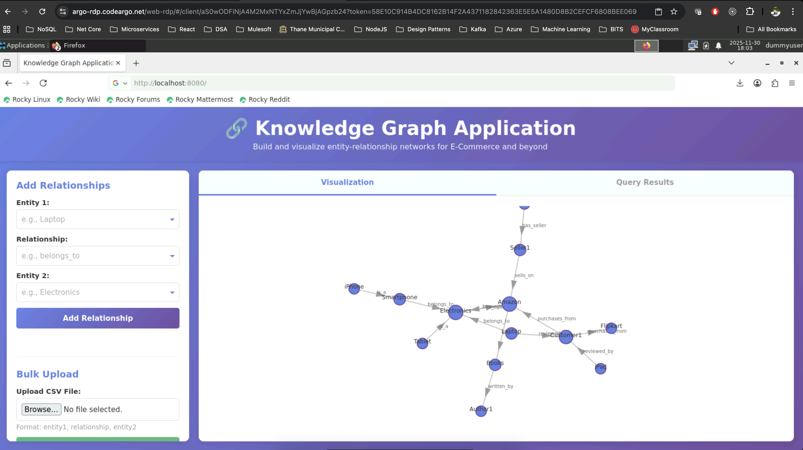
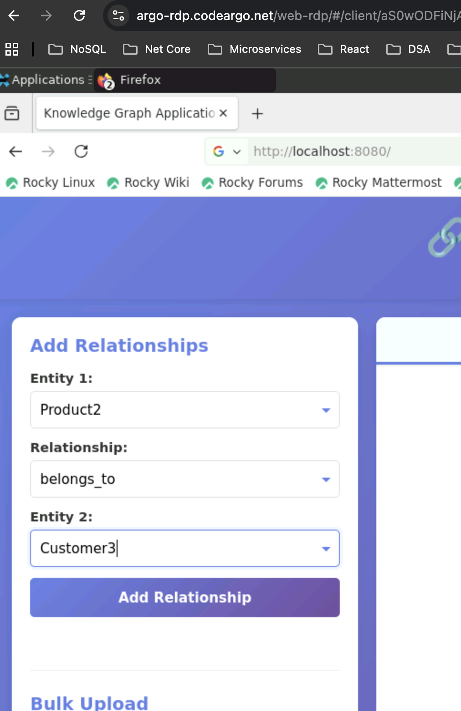
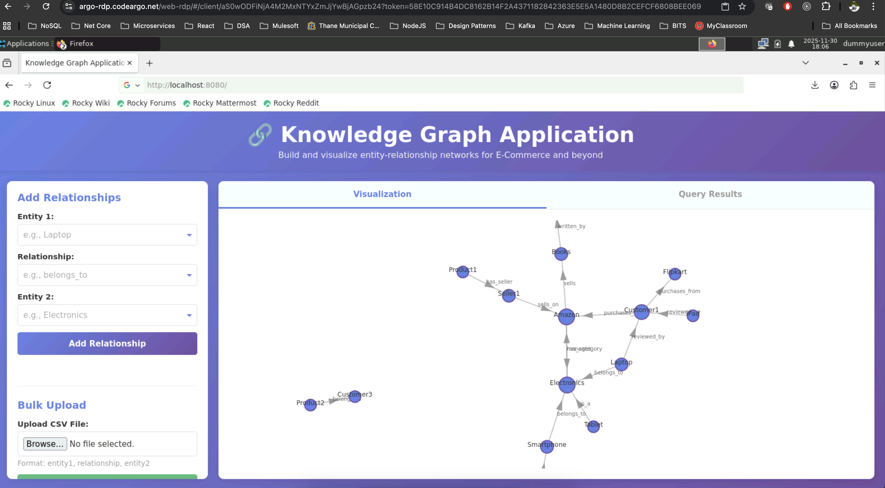
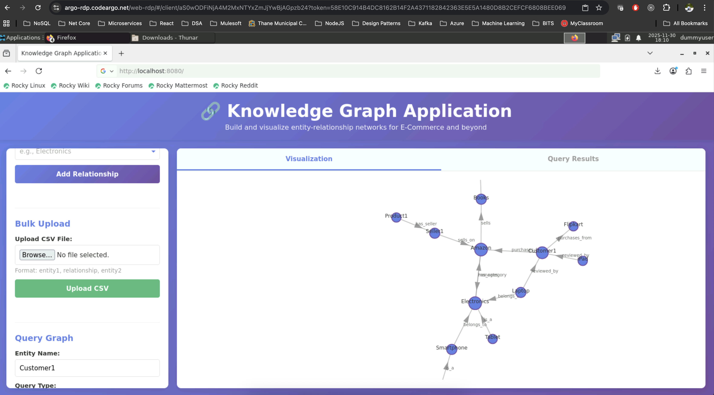
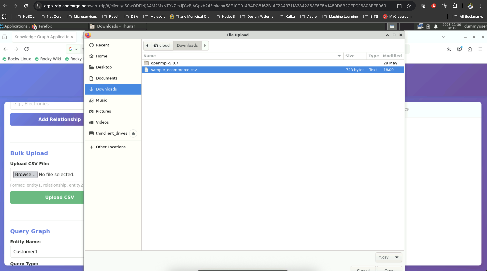
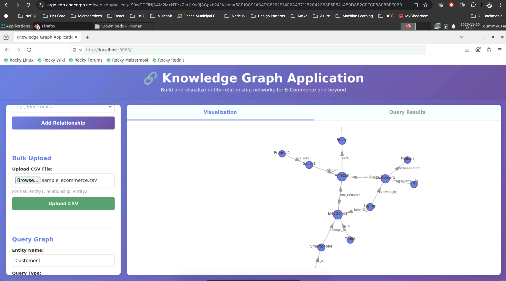
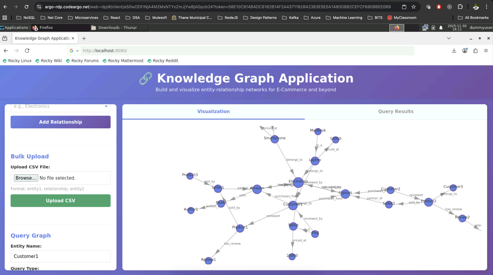
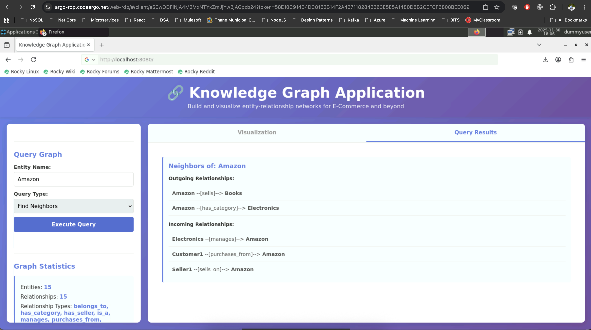
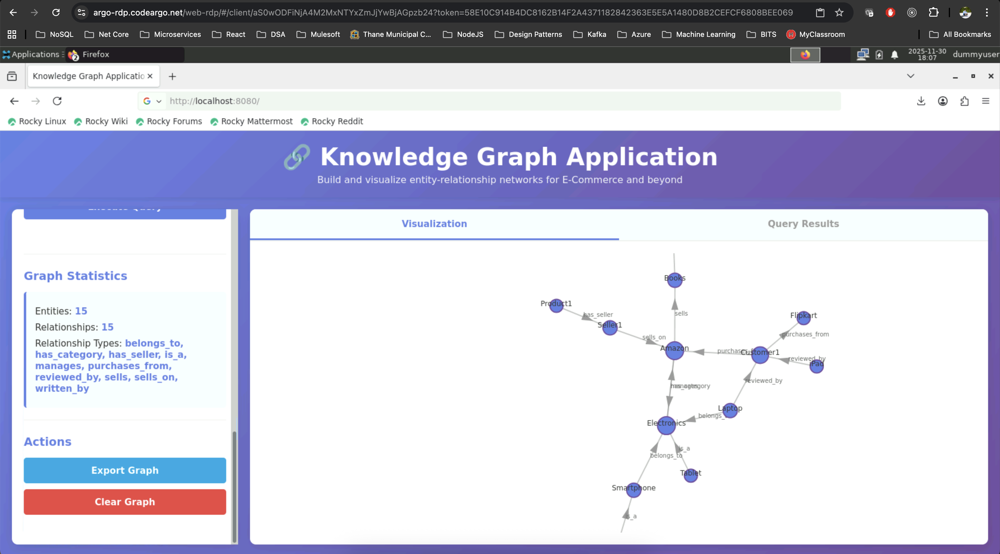

# NLP Assignment 1 - PS 10: Knowledge Graph Application - Part A

### Group ID: 61

### Group Members Name with Student ID:

1. Arpita Singh (2024AA05027) Contribution 100%
2. Rahul Sharma (2024AA05893) Contribution 100%
3. Sachit Pandey (2024AA05023) Contribution 100%
4. Avishek Ghatak (2024AA05895) Contribution 100%
5. Anoushka Guleria (2023AA05527) Contribution 100%

## Overview

A web-based Knowledge Graph application that allows users to input and visualize relationships between entities. The application offers a user-friendly interface to add relationships, query the graph, and display the results dynamically.

Built with Flask backend, NetworkX graph processing, and D3.js visualization.

**Features:**

- ✨ Interactive web interface for adding relationships
- 📊 Real-time graph visualization with D3.js
- 📁 CSV bulk import for datasets
- 🔍 Advanced querying (neighbors, paths, relationship search)
- 📈 Graph statistics and analytics
- 💾 Export functionality (JSON)
- 🚀 Single-command startup

---

## Quick Start

### Prerequisites

- Python 3.7 or higher
- macOS, Linux, or Windows

### Installation & Running

**One-command startup:**

```bash
./run.sh
```

The script will:

1. Create a virtual environment
2. Install all dependencies
3. Start the Flask server
4. Open http://localhost:8080

**Manual startup:**

```bash
# Create virtual environment
python3 -m venv venv
source venv/bin/activate  # On Windows: venv\Scripts\activate

# Install dependencies
pip install -r requirements.txt

# Run the application
python3 -m app.__init__
```

Navigate to `http://localhost:8080` in your browser.

---

## Project Structure

```
knowledge_graph/
├── app/
│   ├── __init__.py              # Flask application & API endpoints
│   ├── knowledge_graph.py        # Graph logic using NetworkX
│   ├── templates/
│   │   └── index.html           # Main web interface
│   └── static/
│       ├── css/
│       │   └── style.css         # Styling
│       └── js/
│           └── app.js            # Frontend logic
├── data/
│   └── sample_ecommerce.csv      # Sample data for demo
├── docs/
│   └── ENHANCEMENT_PLAN.md       # Part B - Scalability improvements
├── requirements.txt              # Python dependencies
├── run.sh                        # Startup script
└── README.md                     # This file
```

---

## Landing Page



## Features & Usage

### 1. Add Relationships Manually

**Input:**

- Entity 1: Source entity (e.g., "Laptop")
- Relationship: Type of relationship (e.g., "belongs_to")
- Entity 2: Target entity (e.g., "Electronics")

**Example:**

```
Entity 1: Product2
Relationship: belongs_to
Entity 2: Customer3
```



Creates a directed relationship: `Laptop --[belongs_to]--> Electronics`



### 2. Bulk Upload CSV

**Format:**

```csv
entity1,relationship,entity2
Laptop,belongs_to,Electronics
Tablet,belongs_to,Electronics
Electronics,managed_by,Amazon
```



**Steps:**

1. Click "Upload CSV File"
   

2. Select `data/sample_ecommerce.csv` or your own CSV
   

3. File must have columns: `entity1`, `relationship`, `entity2`
   

**Maximum file size:** 5MB

4. Renders the Graph
   

### 3. Query the Graph

#### Query Options:

**a) Find Neighbors**

- Shows all entities connected to a given entity
- Displays both incoming and outgoing relationships

**Example:** Query "Amazon" → Shows all products sold, categories managed, etc.




**b) Find Path Between Entities**

- Finds all shortest paths connecting two entities
- Shows the relationships along each path
- Useful for understanding connections

**Example:** Find path from "Customer1" to "Electronics"
→ Path: Customer1 --[purchases_from]--> Amazon --[manages]--> Electronics

**c) Search by Relationship Type**

- Finds all relationships of a specific type
- Shows count and lists all instances

**Example:** Search "reviewed_by"
→ Lists all customers and products they reviewed

### 4. Visualization

- **Interactive graph rendering** using D3.js
- **Node sizing** based on degree (number of connections)
- **Color coding** for easy identification
- **Drag nodes** to reposition
- **Zoom and pan** support
- **Edge labels** show relationship types
- **Arrow markers** indicate direction

### 5. Graph Statistics

Displays:

- Total number of entities
- Total number of relationships
- List of relationship types with counts



### 6. Export & Clear

**Export:** Downloads graph as JSON file

```json
{
  "nodes": ["Entity1", "Entity2", ...],
  "edges": [
    {"source": "Entity1", "target": "Entity2", "relationship": "type"}
  ],
  "stats": {...}
}
```

**Clear:** Removes all relationships (with confirmation)

---

## API Endpoints

All endpoints return JSON responses.

### Add Relationship

```
POST /api/graph/add-relationship

Request:
{
  "entity1": "Laptop",
  "relationship": "belongs_to",
  "entity2": "Electronics"
}

Response:
{
  "status": "success",
  "message": "Relationship added: Laptop --[belongs_to]--> Electronics",
  "graph_stats": {...}
}
```

### Upload CSV

```
POST /api/graph/upload-csv

Request: (multipart form data)
- file: [CSV file]

Response:
{
  "status": "success",
  "added_count": 25,
  "total_count": 25,
  "errors": [],
  "graph_stats": {...}
}
```

### Query Neighbors

```
POST /api/graph/query-neighbors

Request:
{
  "entity": "Amazon",
  "direction": "both"  // "in", "out", or "both"
}

Response:
{
  "status": "success",
  "entity": "Amazon",
  "neighbors": {
    "outgoing": [{"target": "Electronics", "relationship": "manages"}],
    "incoming": [{"source": "Customer1", "relationship": "purchases_from"}]
  }
}
```

### Find Path

```
POST /api/graph/find-path

Request:
{
  "source": "Customer1",
  "target": "Laptop"
}

Response:
{
  "status": "success",
  "source": "Customer1",
  "target": "Laptop",
  "paths_found": 2,
  "paths": [
    [
      {"entity": "Customer1", "relationship": "purchases_from"},
      {"entity": "Amazon", "relationship": "sells"},
      {"entity": "Laptop"}
    ]
  ]
}
```

### Search by Relationship

```
POST /api/graph/search-relationship

Request:
{
  "relationship": "belongs_to"
}

Response:
{
  "status": "success",
  "relationship": "belongs_to",
  "count": 3,
  "results": [
    {"source": "Laptop", "target": "Electronics", "relationship": "belongs_to"}
  ]
}
```

### Get Graph Data

```
GET /api/graph/data

Response:
{
  "nodes": [{"id": 0, "label": "Laptop", "size": 15}, ...],
  "links": [{"source": 0, "target": 1, "relationship": "belongs_to"}, ...]
}
```

### Get Statistics

```
GET /api/graph/stats

Response:
{
  "status": "success",
  "stats": {
    "total_entities": 25,
    "total_relationships": 50,
    "relationship_types": {"belongs_to": 5, "manages": 3, ...}
  }
}
```

### Export Graph

```
GET /api/graph/export

Response: JSON file download
```

### Clear Graph

```
POST /api/graph/clear

Response:
{
  "status": "success",
  "message": "Graph cleared",
  "graph_stats": {...}
}
```

---

## Sample E-Commerce Use Cases

### Use Case 1: Product Recommendations

Query: Find all products in the same category as the purchased product

```
1. Get category of purchased product
2. Find all products in that category
3. Filter by seller reputation and ratings
```

### Use Case 2: Supply Chain Analysis

Query: Trace the path from customer to supplier

```
Customer → Order → Product → Seller → Supplier → Manufacturer
```

### Use Case 3: Fraud Detection

Query: Find unusual patterns

```
- Multiple orders by same customer in short time
- Cross-seller connections
- Suspicious review patterns
```

### Use Case 4: Category Navigation

Query: Build hierarchical category view

```
Electronics
├── Laptops
│   ├── Gaming
│   └── Business
├── Smartphones
│   ├── iPhone
│   └── Android
```

### Use Case 5: Influencer Identification

Query: Find most connected sellers/reviewers

```
Calculate degree centrality
Identify top reviewers, sellers, categories
```

---

## Sample Data

A sample E-Commerce CSV file is included at `data/sample_ecommerce.csv` with:

- 25+ relationships
- E-Commerce entities (products, categories, sellers, customers, reviews)
- Various relationship types

**To use sample data:**

1. Open the web interface
2. Click "Upload CSV File"
3. Select `data/sample_ecommerce.csv`
4. Click "Upload CSV"

The graph will populate with example E-Commerce relationships.

---

## Technologies Used

### Backend

- **Flask** (Web framework)
- **NetworkX** (Graph processing)
- **Pandas** (Data processing)
- **Werkzeug** (File handling)

### Frontend

- **HTML5** (Structure)
- **CSS3** (Styling)
- **JavaScript** (Interactivity)
- **D3.js v7** (Graph visualization)

### Architecture

- **REST API** for backend communication
- **JSON** for data interchange
- **Directed Graph** data structure

---

## Performance Characteristics

### Current Implementation

- **Maximum dataset:** ~100,000 relationships
- **Query response time:** 50-500ms
- **Supported concurrent users:** 10-20
- **Memory usage:** ~1GB for 100K relationships

### Limitations

- Single-threaded processing
- All data in memory
- No persistence across restarts

### For Large-Scale Deployments

See `docs/ENHANCEMENT_PLAN.md` for:

- Database optimization (Neo4j)
- Distributed processing
- Caching strategies
- Multi-server architecture

---

## Support

### Documentation

- API Docs: See "API Endpoints" section
- Enhancement Plan: `docs/ENHANCEMENT_PLAN_PART_B.md`
- Sample Data: `data/sample_ecommerce.csv`

### Quick Help

- **Get Started:** Run `./run.sh`
- **Upload Demo Data:** Use sample CSV
- **Learn Queries:** Try each query type
- **Explore Graph:** Drag nodes in visualization
